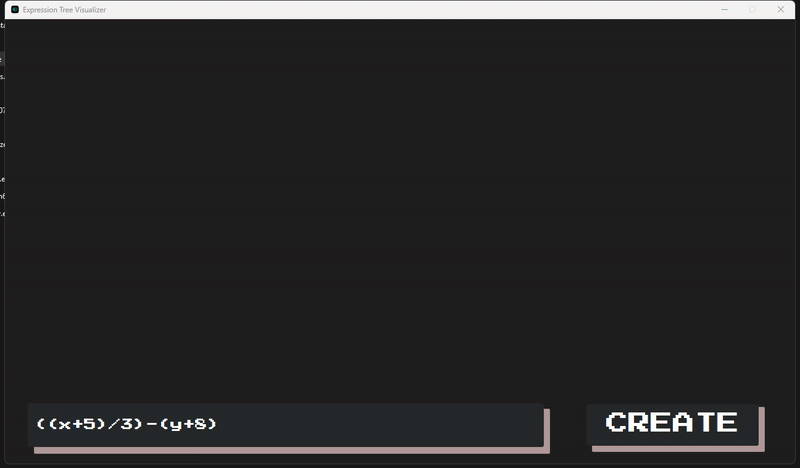

# 🌿 JAVAFx Expression Visualizer

**JAVAFx Expression Visualizer** is a desktop application built using JavaFX that allows users to **create and visualize expression trees** and observe how they are traversed through animated visualizations. This was my **first JavaFX project**, developed during my **2nd year as a Computer Science student**, focused on improving my understanding of trees and graphical UI programming.

## 📸 Screenshots

## 🎯 Purpose

This tool was created as a hands-on learning project to help visualize expression trees and understand how different tree traversal algorithms (preorder, inorder, postorder) operate. It turns abstract data structures into a clear, interactive visual experience.

## ✨ Features

### 🌳 Expression Tree Visualization

* Convert arithmetic expressions into a binary expression tree
* Visualize the tree structure in a clean and organized layout

### 🛠️ Create Mode

* Manually input expressions to build trees
* Automatically parse and validate input expressions

### 🔁 Animated Tree Traversals

* **Preorder Traversal** – Visit root, then left, then right
* **Inorder Traversal** – Visit left, then root, then right
* **Postorder Traversal** – Visit left, then right, then root
* Animation highlights each visited node in sequence for better comprehension

## 🧑‍💻 Author

Developed by [@AceBurgundy](https://github.com/AceBurgundy)
This project marked the beginning of my journey into **JavaFX development** and gave me a strong foundation in building GUI-based applications in Java.

## 📄 License

This project is open-source and free to explore, modify, and learn from.
See the [LICENSE](https://github.com/AceBurgundy/JAVAFx-ExpressionTree-Visualizer/blob/master/LICENSE) file for details.
